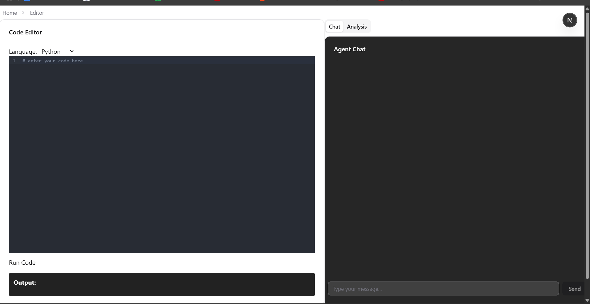

# Nudge: Your AI-Powered Coding & DSA Practice Platform

Nudge is an interactive, AI-driven platform designed to help beginners and enthusiasts master Data Structures and Algorithms (DSA) through hands-on coding, instant feedback, and smart guidance.

Whether you're preparing for interviews or building your foundational skills, Nudge provides a supportive environment with real-time code analysis, chat-based assistance, and a modern code editor—all tailored to accelerate your learning journey.